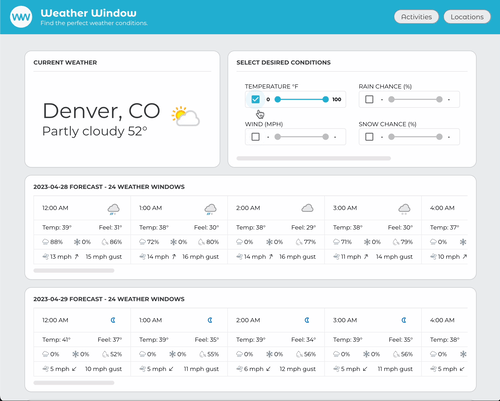

# Weather Window

Weather Window is a React web application that allows users to find that perfect window of weather for their upcoming outdoor adventure. Activities such as running, fishing, golf, or skiing are elevated to another level of enjoyment when the weather is just right. With Weather Window, users can input their desired weather conditions such as temperature, wind speed, or chance of rain and discover hours in the upcoming forecast that meet their weather standards.
***

### Live App Link
[Weather Window](https://github.com/kirch1/weather-window)
***

### Preview of App

***

### Technologies Used
- JavaScript
- React
- React Router
- React PropTypes
- Cypress Testing
- [Weather API](https://www.weatherapi.com/)
***

### Learning Goals
- Demonstrate understanding of:
  - React
  - React Hooks and React Router
  - End to end testing wtih Cypress
  - Asyncronous Javascript
***

### Challenges
- Complete primary features within a limited scope
- Add functionality beyond visualizing API data
***

### Local Installation Instructions

To clone a copy of the project to a remote repository, follow these steps:

1. Clone down a local copy of [the repository](https://github.com/kirch1/weather-window).
1. `cd` into the repository.
1. Run `npm install`.
1. Run `npm start`.
1. Navigate to the localhost url listed in Terminal.
